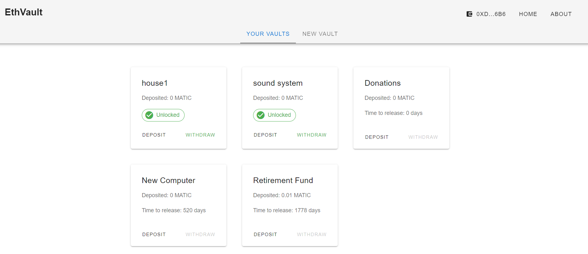

# CoinVault
A simple dapp that allows you to deposit and save funds for your goals




As a first dapp project I chose to create a smart contract that will hold your funds for desired amount of time, and, once this time
passes, you will be able to withdraw all your assets back. This could be useful for creating a retirement fund, save money for a goal or simply 
HODL the assets without a direct access to them. Don't let the emotions drive your decisions when it comes to money. Noone will be able to access your funds except you. The contract is written in Solidity and can be deployed to any EVM-compatible chain. The code in this repository will be used as a Vue.js boilerplate for all my future Web3 projects. I'll be more than happy if it's useful for you. 

## Currently deployed & tested with the following blockchains

* **Binance Smart Chain mainnet**
* **Polygon mainnet**

## Currently supported wallets
* **Metamask**

!Important! The smart contract has not been audited by an external party, send funds at your own risk! 

## Technologies used

* **Vue.js & VUEX**
* **Vuetify component library**
* **Solidity**
* **ethers.js**
* **Remix for contract deployment**


To run the client app locally: 

## CD into the client folder 
```
cd client 
```

## Install dependencies
```
npm install
```

### Compiles and hot-reloads for development
```
npm run serve
```


To compile & deploy the smart contract (in case you modify the contract): 

### TLDR: I had problems with my wifi card and deployment to mainnets worked only through remix. For testnets you can use the following:

## In the root directory: 

## compile the smart contracts ABI
```
truffle compile
```

## Deploy contract to a network
```
truffle migrate --reset --network mumbaitestnet
```

### Compiles and hot-reloads for development
```
npm run serve
```
